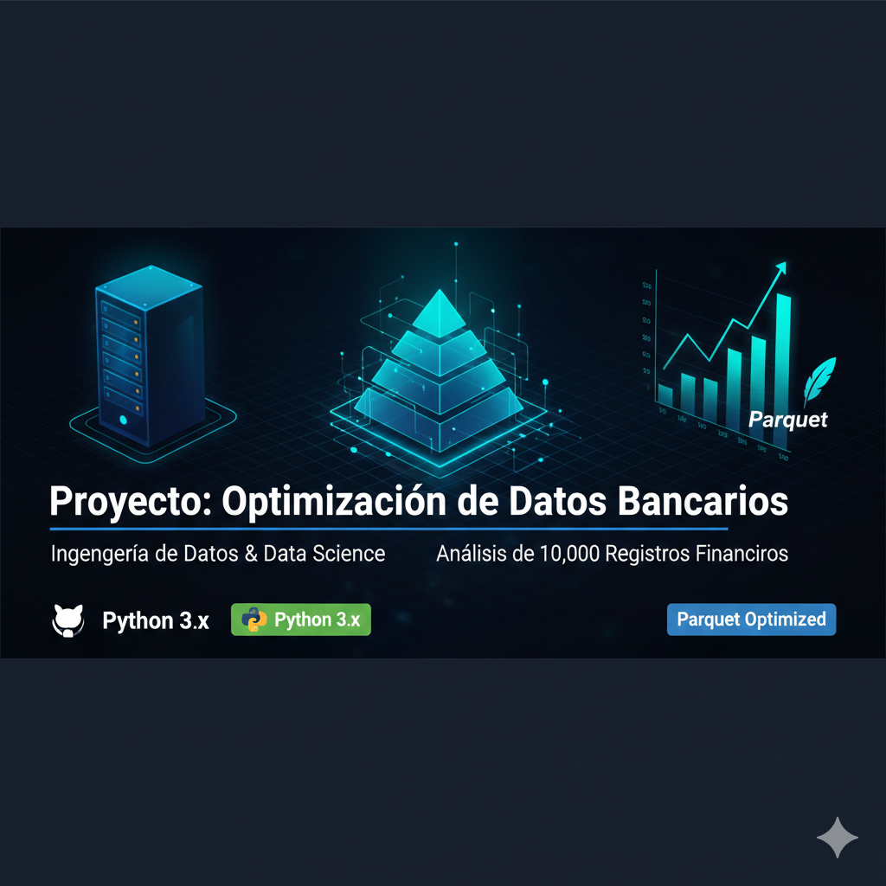

# 🏦 Proyecto: Optimización de Datos Bancarios

## 📝 Resumen del Proyecto
En esta semana logré descargar 10,000 registros bancarios, los limpié con Python y los optimicé en formato Parquet.

### 🚀 Logros técnicos:
* **Limpieza:** Procesamiento con Pandas.
* **Optimización:** Conversión a Parquet para mayor velocidad.

📊 Proyecto: Sistema de Monitoreo de Salud Financiera y Retención de Clientes1. Introducción y ObjetivoEste proyecto desarrolla un pipeline de datos integral para una entidad financiera, enfocado en la detección temprana de la fuga de clientes (Churn). El objetivo es transformar datos transaccionales crudos en hallazgos estratégicos para la toma de decisiones en el directorio.2. Perfil Técnico del Proyecto (Stack Tecnológico)Para cumplir con los estándares de Experiencia Técnica y Nube:Lenguajes: Python (Pandas/PySpark) para manipulación de volúmenes de datos.Procesamiento: Creación de pipelines de datos para limpieza y orquestación.Modelado: Ingeniería de datos para segmentación de carteras según comportamiento financiero.Almacenamiento: Gestión de datos optimizados en formato Parquet (Simulación de AWS S3).3. Análisis de Negocio (Storytelling)A diferencia de un análisis académico, este informe se centra en hallazgos estratégicos para el negocio:A. Segmentación por Nivel de SaldoUtilizamos lógica de programación para clasificar a los clientes según su patrimonio ($S$):$$ f(S) = \begin{cases}\text{Sin Saldo} & \text{si } S = 0 \\text{Saldo Bajo} & \text{si } 0 < S < 50,000 \\text{Saldo Medio} & \text{si } 50,000 \leq S < 150,000 \\text{Saldo Alto} & \text{si } S \geq 150,000\end{cases} $$Hallazgo: Los clientes de Saldo Bajo presentan la mayor tasa de abandono ($\approx 35\%$), lo que sugiere una falta de bancarización o productos de entrada atractivos.B. El Factor Demográfico (Edad)El análisis visual revela un "pico" crítico de fuga entre los 40 y 50 años.Insight: El banco está perdiendo a su segmento de clientes con mayor estabilidad laboral. Se recomienda revisar la oferta de productos de inversión o seguros de vida.4. Métricas de Control (KPIs)El éxito del pipeline se mide a través del Churn Rate calculado:$$\text{Churn Rate} = \frac{\sum \text{Clientes Fugados}}{\text{Total Clientes}}$$5. Próximos Pasos: Evolución hacia MLComo etapa final, el proyecto escalará hacia la implementación de Machine Learning e Inteligencia Artificial. Se desarrollará un modelo predictivo (Regresión Logística o Random Forest) para identificar proactivamente a los clientes con alta probabilidad de fuga antes de que abandonen la entidad.
